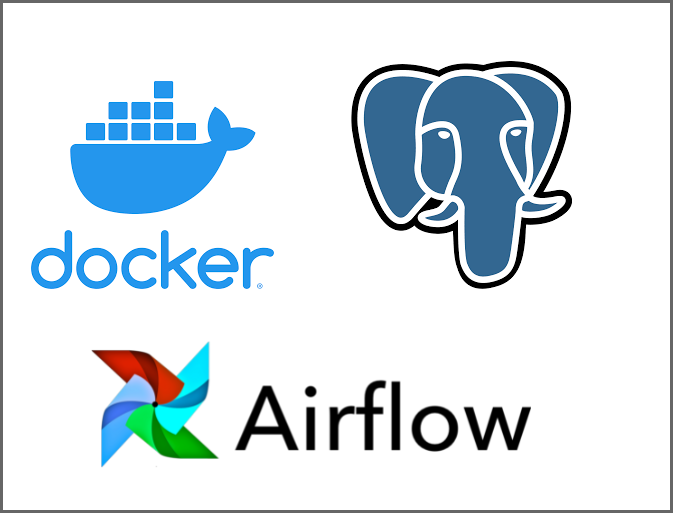
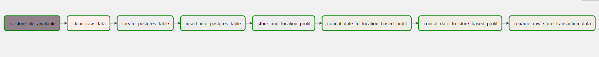

# Project Description
The purpose of this project is to orchestrate a data pipeline that accepts raw store transactional data from a directory file structure and then clean and transform it and thereafter load it into a postgres database for analytical purposes.

# Tools 
The project makes use of docker, airflow and postgres database

# ETL Description
Airflow was used to orchestrate the data pipeline to track receival of raw store transactional data from
`store_files/raw_store_transactions` after which `dags/datacleaner.py` script was then used to apply some transformations on the dataset in order to make it ready for analytical queries. Subsequently, tasks involved loading of the data into the database which is performed by doing a proper volume mounting between the docker container and the local environment. Finally, Adhoc queries were launched on the database to obtain location-based and store-based profit while also storing the result of the queries as
transformed csv files in `store_files/` directory.

The following shows the successful running of the airflow DAG required for automating the ETL pipeline.

